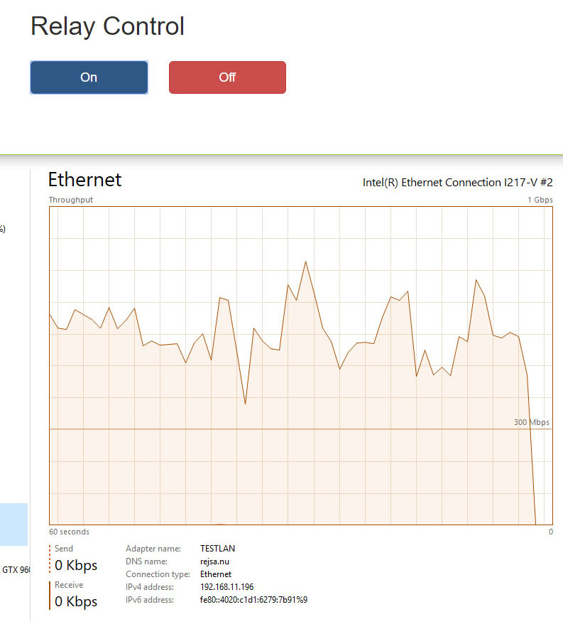
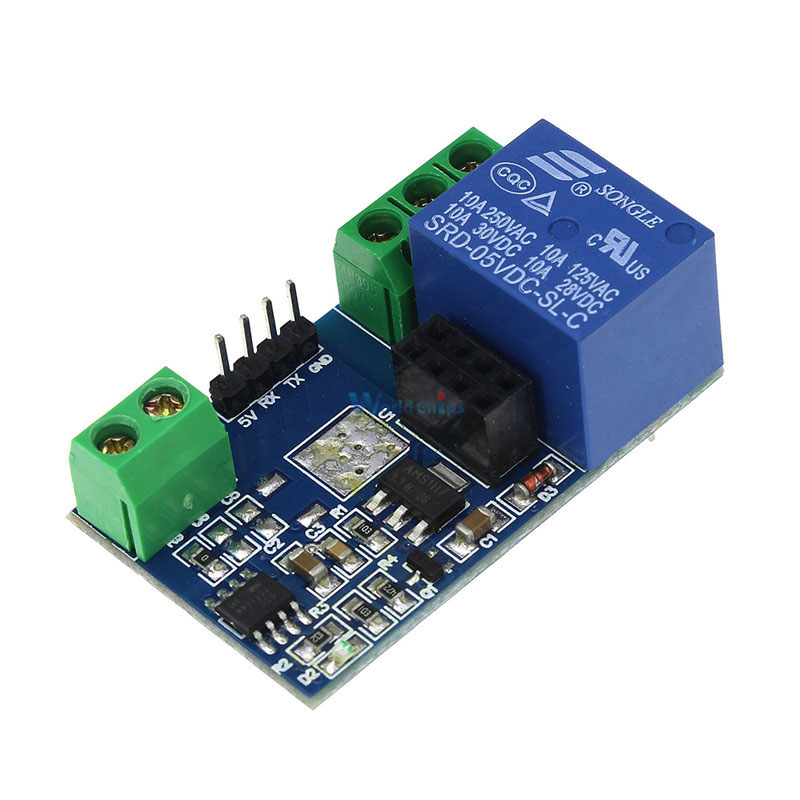
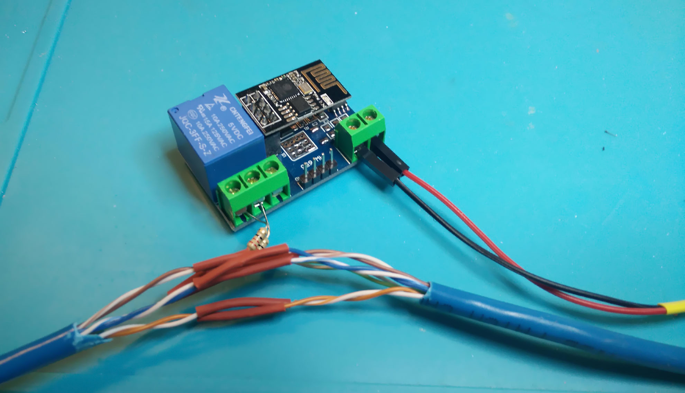

# networkKillSwitch
Yet another pretty crazy item. A guy wanted to remotely be able to make an ethernet cable disconnect and connect.

So I spliced an ethernet cable and carefully connected two 22 Ohm resistors to the two wires of the twisted pair #2. That's the two twisted wires from pin 3 and 6. Then I connected the two resistors to a relay board that is specially made to hook up to an ESP8266-01.

Using the libraries aREST and aREST_UI and this code you can switch the relay on and off via a web page or REST calls to the same. When the relay turns on it connects the two resistors together which results in such a load on the connected twisted pair that the cable does not function. Turn the realy off, the resistors are disconnected from each other and everything works again.

Since the board needs to log on to your Wifi so you can surf to it's web page you must edit the code to enter your wifi network name and password.

I've tried it on a Gigabit network without any problems. But when you splice the cable make sure all the twisted pairs are well twisted all the way. Also do not connect any long wires to the resitors, this could make the network cable behave badly.

# Some pics or it didn't happen

Turn the connection off via a web page on your Wifi:

The code only works with relay boards that look exctly like this:. 

Connecting it all together. I power the thing from an ordinary USB 5V charger (the black and red wires to the right of the picture)

